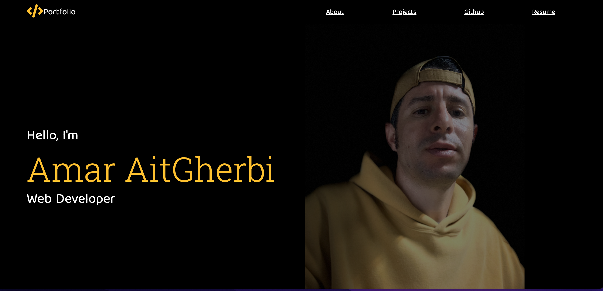
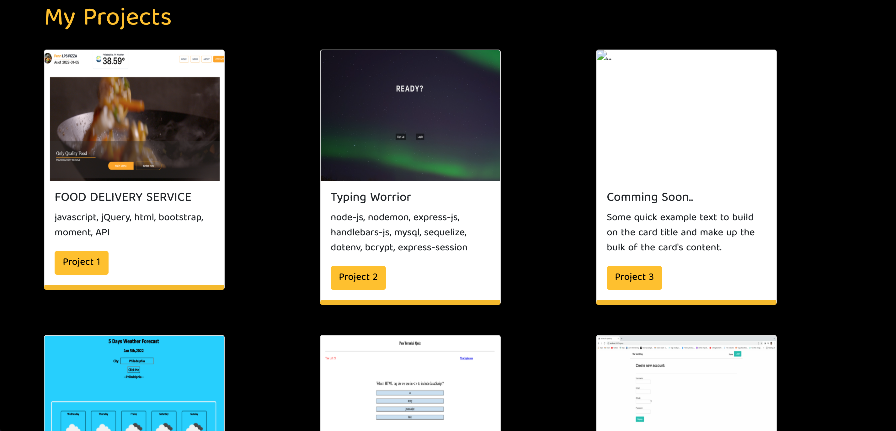
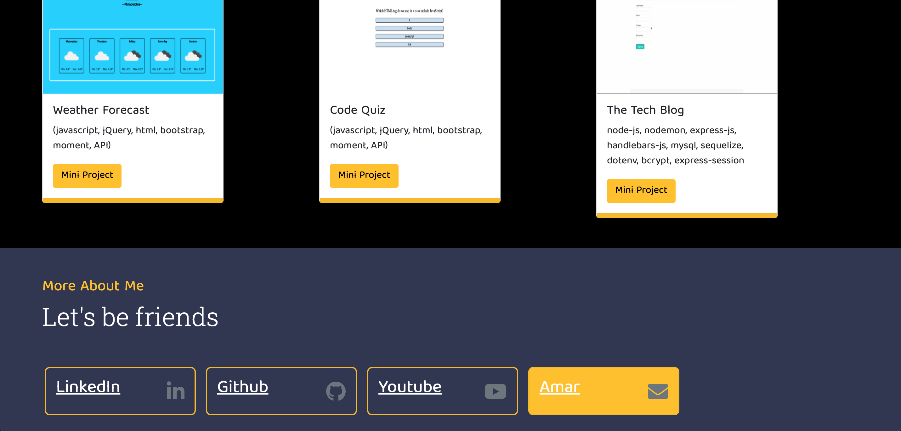

# Portfolio

* Description
* User Story 
* Installations
* Contributing
* Licence
* Demo Video
* Screen Shots
* Questions

# Description 
this project represent personal full stack development portfolio,

# User-Story

```AS AN employer looking for candidates with experience building single-page applications
I WANT to view a potential employee's deployed React portfolio of work samples
SO THAT I can assess whether they're a good candidate for an open position ```

# Installations


# Contributing 
A work in progress. And the possibilities are endless.
Please feel free to submit any code updates for review and acceptance.

# Licensese 
 * [](https://opensource.org/licenses/MIT)

# Project Demo Video
 * [Demo Video](https://watch.screencastify.com/v/XcpfBM1F9bDahvo9oQ5G)


 # Screenshots:
 * 
 * 
 * 
 
 
# Questions
 please feel free to ask me any questions.

 * augustine2903a@gmail.com


